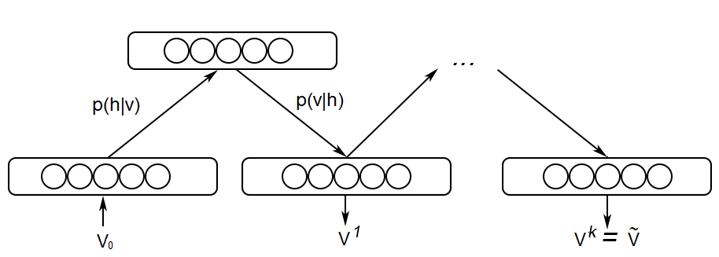

In this assignment, we shall create a function to perform Gibbs sampling k times within contrastive divergence often referred to as CD-k. Let's understand the structure of the notebook and the CD-k training process:

* Importing the dataset.
* Create a bag of words model.
Note that the shape of a bag of words model will be (data_size, vocablury_size)
Please note that the above shape might vary with the way you perform bag of words model but the index data_size will be the same.
* Training using CD-k. This involves performing Gibbs sampling k-times which can be better understood using the following image.

1. You start with the input batch of data, v0. 
2. You then calculate   Vectorized implementation: p(h|v0)=σ(C + V.W)
3. Using this p(h|v0), you sample h0.
4. Now that you have got h0, you calculate
  Vectorized implementation: p(v|h0)=σ(B+H.WT)
5. Using this p(v|h0), you sample v1.

You repeat this k times till you get hk and vk.

Step 2 and 3 are performed in the function *sampleHiddenLayer()* while Step 4 and 5 are performed in *sampleVisibleLayer()*. 

*sampleHiddenLayer()* and *sampleVisibleLayer()* are combined to create a function *gibbs()* which does one iteration of Gibbs sampling.

gibbs is repeated k-times in the function *cd_k()* to perform Contrastive Divergence k-times.

To maximize the joint probability distribution, using the energy function as defined in the above sampling process, the update matrices and vectors simplify as follows:

    ΔW=v0⊗p(h0|v0)−vk⊗p(hk|vk)
    Δb=avg_across_batch(vo−vk)
    Δc=avg_across_batch(p(h0|vo)−p(hk|vk))

You do average across batch because you need a vector update for the bias vectors and vo,vk and p(h0|vo),p(hk|vk) are matrices.

 

Note that the exact derivations are not covered as it is very complex and the Prof. has given the intuition about the training process in the previous segments.

 

Since you have to maximize the joint probability distribution, you use gradient ascent here with momentum. It is recommended that you understand the working of momentum from here.

 

The momentum equations are as follows:

    mWt=γ mWt−1−ΔW
    mbt=γ mbt−1−Δb
    mct=γ mct−1−Δc

γ is the momentum coefficient here.

Using these momentum terms, you update the weights and biases as follows:

    Wt=Wt−1+α mWt
    bt=bt−1+α mbt
    ct=ct−1+α mct

α is the learning rate.

The above equations are implemented in the function train().